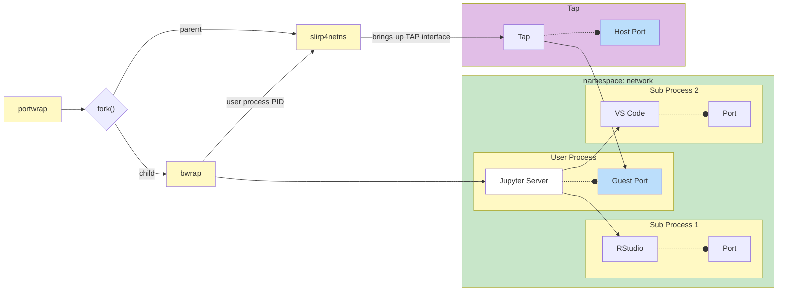
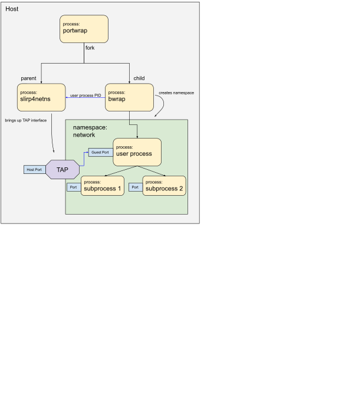

portwrap
========
portwrap launches a specified program into a user and network namespace. It
routes traffic to the program from a host port to the namespace's guest port.
If other programs are started in the namespace, their open ports will only be
accessible to the namespace and not to the host.

This might be useful if the program it launches knows how to proxy traffic to other programs in the namespace.

portwrap is a python script that calls `slirp4netns` and `bubblewrap` (`bwrap`).





Preparation
-----------

1. The administrator [must configure subuid/subgid mapping](https://rootlesscontaine.rs/getting-started/common/subuid/).
2. Install [slirp4netns](https://github.com/rootless-containers/slirp4netns) and [bubblewrap](https://github.com/containers/bubblewrap).

Installation
------------
```console
pip install git+https://github.com/ryanlovett/portwrap
```

Usage
-----
```console
% portwrap --help
usage: Usage: portwrap [-h] -p HOST_PORT -P GUEST_PORT COMMAND [COMMAND ...]


optional arguments:
  -h, --help            show this help message and exit
  -p HOST_PORT, --host-port HOST_PORT
                        Host-accessible port
  -P GUEST_PORT, --guest-port GUEST_PORT
                        Namespace-accessible port
```

If `COMMAND` uses an argument to set a listening port, you can specify the template string `{guest-port}` instead, and `portwrap` will substitute the value of `GUEST_PORT`.

Examples
--------
1. Start JupyterLab on the host port 9876. Note that use of the template string `{guest-port}` below is literal -- you don't substitute anything for it.

```console
% portwrap -p 9876 -P 8888 jupyter lab --port={guest-port} --ip=0.0.0.0 --no-browser
```

   Within the user/network namespace, jupyter will be listening on port 8888. If [jupyter-server-proxy](https://github.com/jupyterhub/jupyter-server-proxy) is installed, its proxied services will be sandboxed by the namespaces and will be reachable by jupyter_server, but not by other processes on the host.
