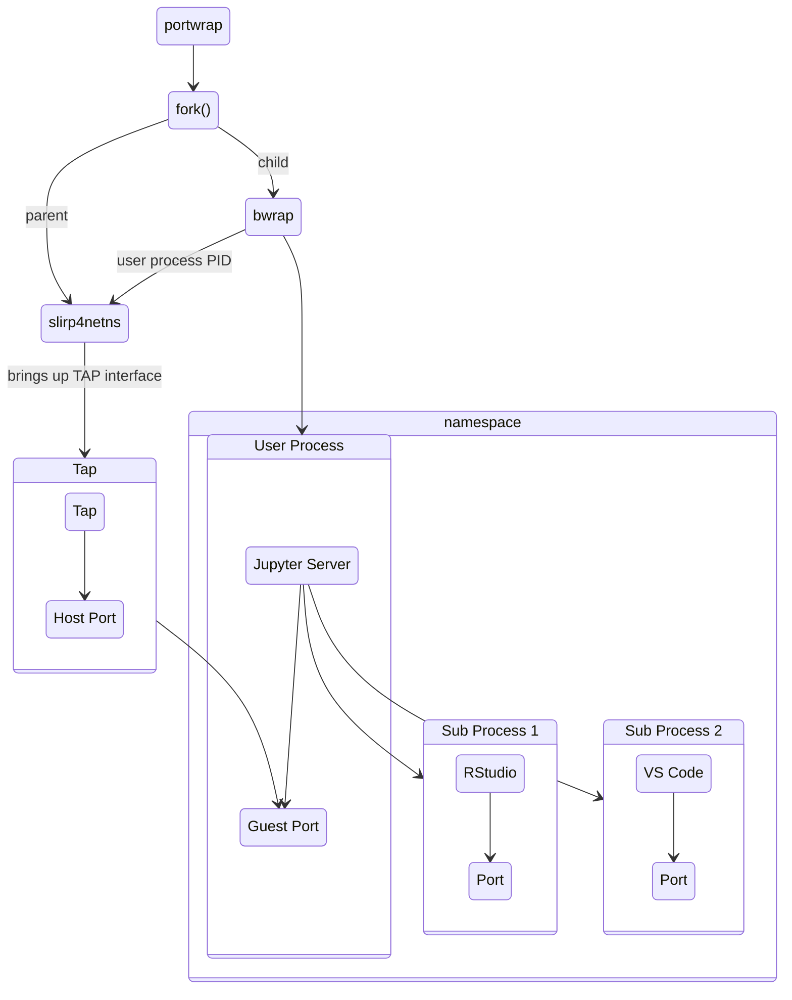

portwrap
========
portwrap launches a specified program into a user and network namespace. It
routes traffic to the program from a host port to the namespace's guest port.
If other programs are started in the namespace, their open TCP and UDP ports
will only be accessible to the namespace and not to the host. The namespace
shares the host's filesystem, so Unix domain sockets on the filesystem remain
reachable in both directions.

This might be useful if the program it launches knows how to proxy traffic to other programs in the namespace.

portwrap is a python script that calls `slirp4netns` and `bubblewrap` (`bwrap`).


```mermaid
stateDiagram
  direction TB
  state User_Process {
    direction TB
    process --> guest_port
    guest_port
    process
  }
  state Sub_Process_1 {
    direction TB
    sub_process_1 --> sp1_port
    sp1_port
    sub_process_1
  }
  state Sub_Process_2 {
    direction TB
    sub_process_2 --> sp2_port
    sp2_port
    sub_process_2
  }
  state namespace {
    direction TB
    process --> Sub_Process_1
    process --> Sub_Process_2
    state User_Process {
      direction TB
      guest_port
      process
    }
    state Sub_Process_1 {
      direction TB
      sp1_port
      sub_process_1
    }
    state Sub_Process_2 {
      direction TB
      sp2_port
      sub_process_2
    }
  }
  state TapGraph {
    direction TB
    tap --> host_port
    tap
    host_port
  }
  TapGraph --> guest_port
  portwrap --> fork
  fork --> slirp4netns:parent
  fork --> bwrap:child
  bwrap --> User_Process
  slirp4netns --> TapGraph:brings up TAP interface
  bwrap --> slirp4netns:user process PID
  fork:fork()
  User_Process:User Process
  guest_port:Guest Port
  process:Jupyter Server
  Sub_Process_1:Sub Process 1
  sp1_port:Port
  sub_process_1:RStudio
  Sub_Process_2:Sub Process 2
  sp2_port:Port
  sub_process_2:VS Code
  TapGraph:Tap
  tap:Tap
  host_port:Host Port
```

Preparation
-----------

1. The system must allow unprivileged users to create user namespaces:
   - `user.max_user_namespaces` must be greater than 0.
   - On older Debian kernels, `kernel.unprivileged_userns_clone` must be 1.
   - On Ubuntu 23.10 and later, AppArmor restricts unprivileged user
     namespaces (`kernel.apparmor_restrict_unprivileged_userns`). `bwrap`
     needs an AppArmor profile that permits them, or the restriction must be
     disabled.
2. Install [slirp4netns](https://github.com/rootless-containers/slirp4netns) and [bubblewrap](https://github.com/containers/bubblewrap).

Installation
------------
```console
pip install git+https://github.com/ryanlovett/portwrap
```

Usage
-----
```console
portwrap [-h] [--host-addr HOST_ADDR] -p HOST_PORT -P GUEST_PORT COMMAND [COMMAND_ARG ...]
```

- `-p`, `--host-port`: the port on the host that is forwarded into the namespace.
- `-P`, `--guest-port`: the port the program listens on inside the namespace.
- `--host-addr`: the host address to listen on. Defaults to `0.0.0.0`, which
  makes the forwarded port reachable from other machines on the network. Use
  `--host-addr 127.0.0.1` to only accept connections from the local host.

If `COMMAND` uses an argument to set a listening port, you can specify the template string `{guest-port}` instead, and `portwrap` will substitute the value of `GUEST_PORT`.

Inside the namespace the program's address is 10.0.2.100, not 127.0.0.1, so
it must listen on that address or on `0.0.0.0` for forwarded traffic to reach
it.

Examples
--------
1. Start JupyterLab on the host port 9876. Note that use of the template string `{guest-port}` below is literal -- you don't substitute anything for it. `--ip=0.0.0.0` is required so that jupyter accepts forwarded connections.

```console
% portwrap -p 9876 -P 8888 jupyter lab --port={guest-port} --ip=0.0.0.0 --no-browser
```

   Within the user/network namespace, jupyter will be listening on port 8888. If [jupyter-server-proxy](https://github.com/jupyterhub/jupyter-server-proxy) is installed, its proxied services will be sandboxed by the namespaces and will be reachable by jupyter_server, but not by other processes on the host.

Limitations
-----------
- Inside the user namespace only your own user and group IDs are mapped. Files
  owned by other users, including root, appear to be owned by `nobody`
  (65534). Programs that check file ownership may fail. For example, `ssh`
  rejects files included from `/etc/ssh/ssh_config.d/` with "Bad owner or
  permissions"; `ssh -F ~/.ssh/config` skips the system configuration.
- If every nameserver in the host's `/etc/resolv.conf` is a loopback address
  (e.g. systemd-resolved's 127.0.0.53), it is unreachable from the namespace.
  In that case portwrap gives the namespace its own copy of `resolv.conf` that
  uses slirp4netns's DNS forwarder at 10.0.2.3.
- Programs in the namespace can't connect to services listening on the host's
  loopback interface.
